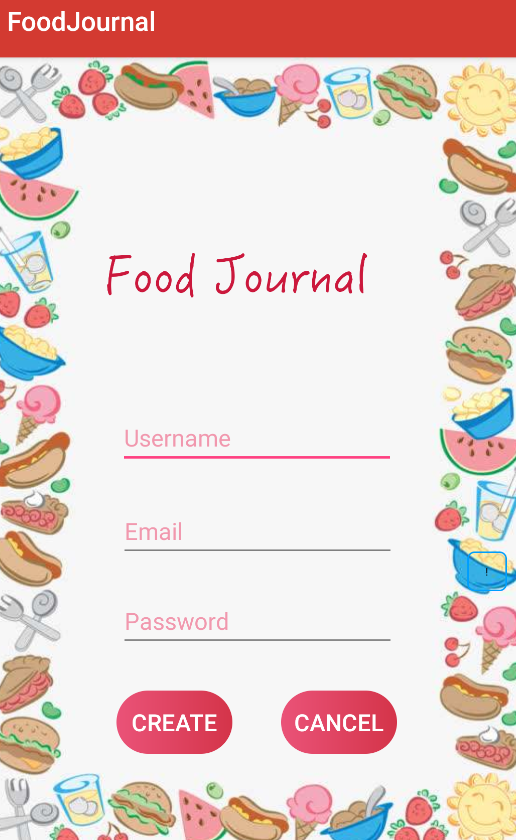
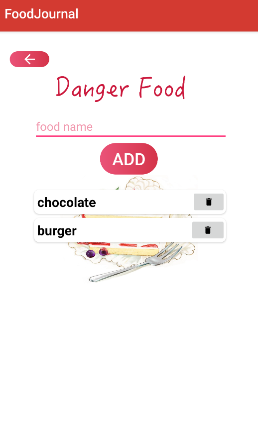
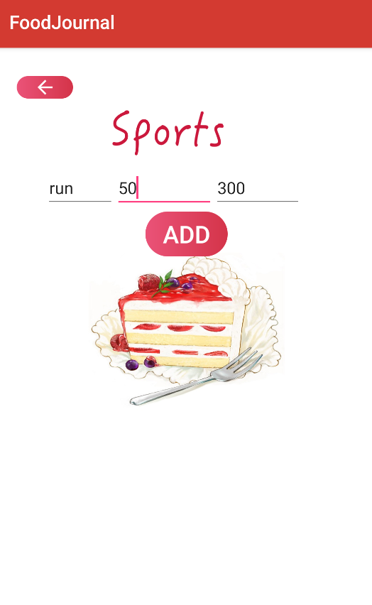

# Food Journal App Project Overview

## **User Manual**

### **Introduction**
In our fast-paced modern lives, we rarely find time to care for ourselves and maintain our own health. Too busy and stressed from our daily routines full of studying or working, we often consider our health as low priority or unimportant. Knowing how to easily and intelligently manage your health is paramount in putting your best self forward, helping you to confront personal challenges and display self-discipline.

The Food Journal is a well-designed product to aid you in monitoring your daily and historical health to help you manage your future. Detailed information about variations in consumption habits, and reminders that deliver warning messages can help you track your health and visualize your idea of positive change. Search Functions and tag books not only enrich your knowledge in the world of food but also shape your beliefs regarding how to recognize healthy and dangerous foods. Stop panicking and start your food journal today.


### **Main page**

When you open this app, you will see the UI main page of our app. There are four basic sections on the main page.

- Account: User can register an account and make a health plan for the Food Journal App.
- Goal card: Shows the user's water goal and calories goal.
- Real-time consumption information: Displays real-time consumption details.
- Daily record selection: User can simply select what kind of activity they will record in this page.
    * Add food / View History
    * Add water / View History
    * Add sports / View History
<div align=center>

</div>


### **Account**

#### Sign up
If the you do not have a user account yet, you can register one here. Click on the “Sign Up” button on the login page and it will lead you to the registration page.
On this page, you will need to specify your username, user email and password. The username can not be the same as an existing one and must start with letters. The user email must be in correct form of a valid email. After finishing, click on the “create” button and you will have your own user account.
<div align=center></div>

#### Login
After registering, you will be able to login to your account using the correct username and password. You have 5 attempts to input the correct information. There is a “sign up” button that leads to the sign up page. Also, the “guest” button will transfer you to the search food recipes page.
<div align=center></div>

#### Guest search food recipe
After you click the “guest” button on login page, it will transfer you to this page. When you input a food recipe name, it will use an API to transfer you to the corresponding website.
<div align=center>


</div>

#### Personal profile page
When you click the edit profile button on the main page, you will be transferred to the personal profile page. This page includes your personal information. The first part is the user's image. You can search, logout, return back to main page, and add danger food through the buttons in this section. The second section is the user's main information. Here, you can edit your profile through the edit button.
<div align=center>

</div>

#### Edit personal profile page
When you click the edit button at the personal profile page, you will enter the edit personal profile page. This page is similar to the personal profile page. The first part is the user's head image without extra buttons. The second part includes user's personal information that can be edited. It has two buttons: confirm button and cancel button.
<div align=center>

</div>

#### Danger food management page
When you click danger food button on the personal profile page, you will enter danger food management page. In the first part, you can record your danger foods. In the second part, you can see the danger food history.
<div align=center>





</div>


### **Daily record selection**

#### Add food
On the 'Myfood' page, you are able to search and add specific foods using key words, the searching result will show you the name of the food and its calories. For example, if you eat an apple today and want to add it, then you can type in ‘apple', the page will show you the calories of an apple, and you can add it by clicking on the ADD button. 
If there are corresponding item in the food database, then the searching results will be listed under the searching bar. 
Also, the searching function supports ambiguous searching, so you can still get the search result even when you only know part of the food’s name. 
At the bottom of ‘Myfood’ page, there is a button ‘VIEW FOOD HISTORY’, which can direct you to the food history page.
<div align=center>


</div>

#### Add sports
When you click the add sports button at the main page, you will enter the sport page. You can record the sports, exercise time and the energy consumption by clicking the ADD button. Under the button, you can see your sports history.
<div align=center>



</div>

#### Add water
When you click add water button at main page, you will enter water page. You can record water amount by clicking the ADD button. Under the button, you can see your water history.
<div align=center>


</div>

#### Food/sports/water history
The food results will be sorted by the time of consumption, with time, amount, calories, and food name. To delete an entry of the food consumption history, click the “delete” button. The “return” button will return to the food search page. The sports results will be sorted by the time of exercise, with time, amount, calories, and sport name. Also, you could delete the sports record by clicking the “delete” button. The “return” button will return to the main page. The water history results will be sorted by the time of drinking and amount. You can also delete the water record by clicking the “delete” button.
<div align=center>

</div>
  
   
## **Support Manual**
### **Introduction**
This file is a support manual for developers of the FoodJournal App. FoodJournal is an app designed for users who want to join the big family of developing health management system, and make contributions to society.
### **Installation and Configuration**
#### Front-end (Android app):
1. Unzip FoodJournal_final.zip, and use Android Studio to open the project. If there is .idea file and app/app/iml file, delete them before opening the project, then Android Studio will have the project path configuration for you

2. SET SEVER:
   >In "food_journal_backend/foodJournal/foodJournalsettings.py"
   >add your own localhost to ALLOWED_HOSTS

3. IMPORT PACKAGES OR DEPENDENCIES
   >In "File->Project Structure->app"
   >add dependencies:	

   	1) 'com.google.code.gson:gson:2.8.5'
   	2) 'com.squareup.okio:okio:2.2.2'
   	3) 'com.squareup.okhttp3:okhttp-ws:3.4.2' 
   	4) 'com.android.support:recyclerview-v7:28.0.0'
   	5) 'com.design:28.0.0'
   	6) 'com.android.support.test:rules:1.0.2'

4.	LOCATE LOCAL SDK
    >In "File->Project Structure->SDK"
   Specify your local SDK path

5. SET DATABASE SOCKET ADDRESS

   After open the project, go to 'com.example.foodJournal.data.CONSTANT', define the variable 

   'dbSocket' to the socket address where the database is listening. For example, '67.159.88.153.8000'
6. RUN APPLICATION

   >Click 'run' in Android Studio to start your food journal

#### Back-end (Django server):
1.	Unzip foodJournalDB.zip and cd into directory .../foodJornalDB/
2.	Enter commands below to start the back-end server where the 0.0.0.0 can be replaced by the server address. The server is built using Django Framework on python3, so Django and python3 should be properly installed. These commands can also be seen in the initserver.py file:
```
python3 manage.py makemigrations
python3 manage.py migrate
python manage.py runserver 0.0.0.0:8000
```

3.	If the server is successfully started, the network traffic as well as HTTP requests sent to the server can be monitored from the terminal. Further, an admin page (which can be accessed at 0.0.0.0:8000/admin) can be used to monitor database inputs from the browser in a more user-friendly manner. 


### **Overall structure of code**

#### Front-end (Android app):

The app consists of 11 Activities. Here are their brief introductions:

- **MainActivity:** The starting point of the app, which has sign in, registration and guest visit functions;

- **MainPageActivity:** The app functionalities overview page, including managers for personal profile, food, water, exercise, and extra features such as reminder and food recipe hunter;

- **SignUpActivity:** A registration page;

- **PersonalProfileActivity:** A personal profile manager, recording personal and health information covering weight, height, gender, age, BMI .etc;

- **EditPersonalProfileActivity:** A personal information editor;

- **FoodNutritionUrlActivity:** The in-app redirection to the food recipe of interest; 

- **GuestActivity:** Capability to search food information without login;

- **FoodManagementActivity:** Two involved features are search food information and enter the personal food history page;

- **FoodDetailActivity:** Description and Detail about food of interest;

- **FoodHistoryActivity:** Food history viewer with delete button for each piece of history;

- **ExerciseManagementActivity:** (Incomplete) search sport/exercise information;

- **ExerciseHistoryActivity:** Exercise history viewer with delete buttons;

- **WaterHistoryActivity:** An activity which can add or delete drink;


#### Key APIs into the back-end (Android app):

All back-end accessing in this project are through REST Url

- **Signup:** http://"+dbSocket+"/food/account

- **Login:** http://"+dbSocket+"/food/authentication

- **Edit personal profile:** http://"+dbSocket+"/food/health_info

- **USDA food nutrition:**
  * Search:  https://api.nal.usda.gov/ndb/search
  * Report:  https://api.nal.usda.gov/ndb/report
  * Nutrition: http://api.nal.usda.gov/ndb/nutrients

- **Food2Fork food recipe:**
  * Search: https://www.food2fork.com/api/search
  * Get: https://www.food2fork.com/api/get

#### Key APIs into the back-end (Django):

##### **Account:**
*Create or delete accounts from the database.*
http://0.0.0.0:8000/food/account/

  * POST
```
Create an account.

Body (form-data):
1) username
2) password
3) email
```
  * DELETE
```
Delete an account.

Parameters:
1) username
```
##### **Health Information:**
*Get, create, or modify health information linked to one user.*
http://0.0.0.0:8000/food/health_info/

  * GET
```
Get an account’s health information.

Parameters:
1) username
```

  * POST
```
Create an account’s health information if it does not already exist. Modifies if it does (each entry in the body is optional if the request is modifying).

Parameters:
1) username

Body (form-data):
1) firstName
2) lastName
3) gender
4) age
5) weight
6) height
7) bmi
8) caloriesPerDay
9) healthTarget
10) foodTimeLapse
11) waterTimeLapse
```
##### **Food:**
*Get, create, or delete foods from an account’s history.*
http://0.0.0.0:8000/food/food/

  * GET
```
Get all food entries from an account’s history.

Parameters:
1) username
```
  * GET
```
Get all food entries from an account’s history for a specific day.

Parameters:
1) username
2) date (comma seperated year,month,day i.e. 2019,3,4) 
```
  * POST
```
Create a new food entry to be entered to an account’s history. This will automatically mark it as a danger food if the same food is listed in the user's danger food list (searches by food name, capitalization doesn't matter)

Parameters:
1) username

Body (form-data):
1) name (this is the name of the food, i.e. apple)
2) calories_gained (optional)
3) foodID (optional)
```
  * DELETE
```
Delete a food from an account’s history.

Parameters:
1) username
2) name (this is the name of the food, i.e. apple)
```
##### **Exercise:**
*Get, create, or delete exercises from an account’s history*
http://0.0.0.0:8000/food/exercise/

  * GET
```
Get all exercise entries from an account’s history.

Parameters:
1) username
```
  * GET
```
Get all exercise entries from an account’s history for a specific day.

Parameters:
1) username
2) date (comma seperated year,month,day i.e. 2019,3,4)
```
  * POST
```
Create a new exercise entry to be entered to an account’s history.

Parameters:
1) username

Body (form-data):
1) name (this is the name of the exercise, i.e. jog)
2) intensity (optional)
3) calories_burned (optional)
4) length (in minutes) (optional)
```

  * DELETE
```
Delete an exercise from an account’s history.

Parameters:
1) username
2) name (this is the name of the exercise, i.e. jog)
```
##### **Water:**
*Get, create, or delete water from an account’s history*
http://0.0.0.0:8000/food/water/

  * GET
```
Get all water entries from an account’s history.

Parameters:
1) username
```
  * GET
```
Get all water entries from an account’s history for a specific day.

Parameters:
1) username
2) date (comma seperated year,month,day i.e. 2019,3,4)
```
  * POST
```
Create a new water entry to be entered to an account’s history.

Parameters:
1) username

Body (form-data):
1) name (this is the name of the exercise, i.e. jog)
2) calories_gained (optional)
3) foodID (optional)
```
  * DELETE
```
Delete a water from an account’s history.

Parameters:
1) username
2) time (this must be the exact time -> take this from the GET request of all water intake)
```

##### **Danger Foods:**
*Get, create, or delete danger foods from an account’s history*
http://0.0.0.0:8000/food/danger_food/

  * GET
```
Get all danger food entries from an account.

Parameters:
1) username
```
  * POST
```
Create a new danger food entry to be entered to an account.

Parameters:
1) username

Body (form-data):
1) name (this is the name of the danger food)
2) foodID (optional)
```
  * DELETE
```
Delete a danger food from an account.

Parameters:
1) username
2) name (this is the name of the danger food)
```
##### **Health Conditions:**
*Get, create, or delete health conditions from an account’s history*
http://0.0.0.0:8000/food/health_condition/

  * GET
```
Get all health condition entries from an account’s history.

Parameters:
1) username
```

  * POST
```
Create a new health condition entry to be entered to an account’s history.

Parameters:
1) username

Body (form-data):
1) name (this is the name of the health condition)
2) description (optional)
```

  * DELETE
```
Delete a health condition from an account’s history.

Parameters:
1) username
2) name (this is the name of the health condition)
```
### **Additional Files**

- **Food-Journal-App-requirements:** the document contains the detailed functional and non-functional requirements of the Food Journal App;

- **Food-Journal-App-architecture:** the document contains the architecture diagram;

- **Food-Journal-App-sprint-plan-risk-management:** the document contains the detailed sprint plan and risk management of the project;

- **Food-Journal-App-preliminary-presentation:** the document contains midterm preliminary presentation slides;

- **Food-Journal-App-test-plan:** the document contains detailed test plan of the app.
